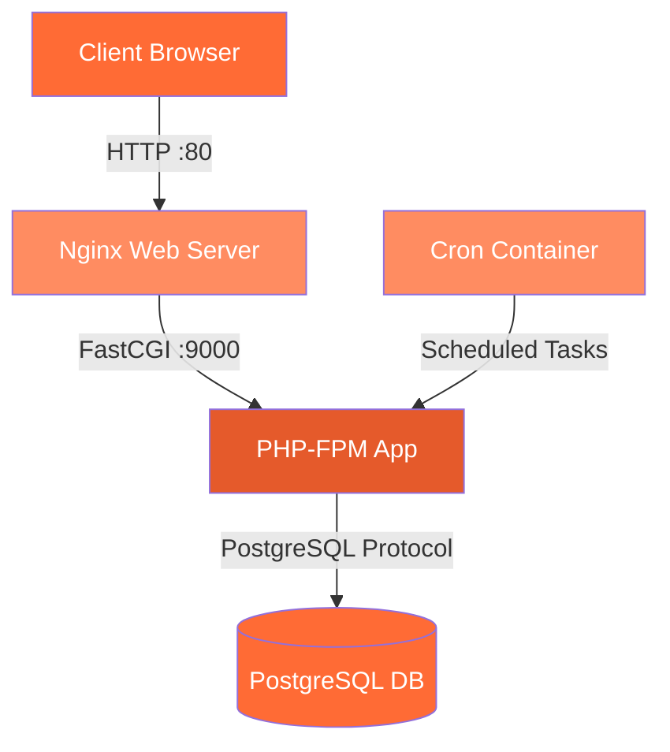

## System Architecture

ipMoodle is built on a multi-container Docker architecture that separates concerns across four specialized services, orchestrated through Docker Compose. This design provides isolation, scalability, and maintainability for your Moodle deployment.

<CardGroup cols={2}>
  <Card title="Database Layer" icon="database">
    PostgreSQL 16 Alpine for data persistence
  </Card>
  <Card title="Application Layer" icon="server">
    PHP 8.2-FPM processing Moodle logic
  </Card>
  <Card title="Web Layer" icon="globe">
    Nginx reverse proxy and static file serving
  </Card>
  <Card title="Automation Layer" icon="clock">
    Dedicated cron container for scheduled tasks
  </Card>
</CardGroup>

## Component Relationships

The architecture follows a layered approach with clear separation of responsibilities:



### Service Dependencies

The containers start in a specific order to ensure dependencies are available:

1. **db** - Database starts first (no dependencies)
2. **app** - Application waits for database (`depends_on: db`)
3. **cron** - Cron service waits for application (`depends_on: app`)
4. **web** - Web server waits for application (`depends_on: app`)

<Note>
All services communicate through the `moodle-net` bridge network, which provides service discovery and network isolation.
</Note>

## Data Flow

### User Request Flow

1. User sends HTTP request to port 80
2. Nginx receives request and routes based on file type:
   - Static files served directly from `/var/www/html`
   - PHP files forwarded to `app:9000` via FastCGI
3. PHP-FPM processes request using Moodle code
4. Application queries PostgreSQL database at `db:5432`
5. Response travels back through the chain to user

### Cron Task Flow

1. Cron container executes Moodle's `admin/cli/cron.php` every minute
2. Script performs maintenance tasks (notifications, cleanup, etc.)
3. Tasks interact with database and filesystem
4. Results logged to prevent accumulation

<Info>
The cron container shares the same volumes as the app container, ensuring consistent access to Moodle code and data files.
</Info>

## Storage Architecture

### Volume Mounts

ipMoodle uses three persistent volumes for data storage:

<CardGroup cols={3}>
  <Card title="Moodle Code" icon="code">
    `./html` → `/var/www/html`
    
    Application code and plugins
  </Card>
  <Card title="User Data" icon="folder">
    `./moodledata` → `/var/www/moodledata`
    
    Uploads, cache, sessions
  </Card>
  <Card title="Database" icon="database">
    `./db_data` → `/var/lib/postgresql/data`
    
    PostgreSQL data files
  </Card>
</CardGroup>

### Shared Filesystem

The `app` and `cron` containers share the same volume mounts with read-write access, while `web` mounts `html` as read-only for security:

```yaml
# App & Cron (read-write)
- ./html:/var/www/html
- ./moodledata:/var/www/moodledata

# Web (read-only)
- ./html:/var/www/html:ro
```

## Network Topology

All containers connect to a single user-defined bridge network (`moodle-net`) with the following benefits:

- **Service Discovery**: Containers can reference each other by service name (e.g., `db`, `app`)
- **Isolation**: Traffic is isolated from other Docker networks
- **DNS Resolution**: Automatic DNS resolution for container names
- **Security**: No external port exposure except web server port 80

<Note>
Only the `web` service exposes a port to the host (`80:80`). All other services are accessible only within the Docker network.
</Note>

## Build vs. Image Strategy

ipMoodle uses a mixed approach:

- **Custom Built Images**: `app` and `cron` use the same Dockerfile for PHP 8.2-FPM with Moodle extensions
- **Official Images**: `db` (postgres:16-alpine) and `web` (nginx:alpine) use official images

This provides the flexibility to customize the PHP environment while leveraging stable, maintained images for infrastructure services.

## Configuration Management

Environment variables are injected at runtime through the `.env` file:

<Accordion title="Database Configuration">
```yaml
POSTGRES_DB: ${DB_NAME}
POSTGRES_USER: ${DB_USER}
POSTGRES_PASSWORD: ${DB_PASS}
```
</Accordion>

<Accordion title="Application Configuration">
```yaml
MOODLE_DB_TYPE: pgsql
MOODLE_DB_HOST: db
MOODLE_DB_NAME: ${DB_NAME}
MOODLE_DB_USER: ${DB_USER}
MOODLE_DB_PASSWORD: ${DB_PASS}
MOODLE_URL: ${SITE_URL}
```
</Accordion>

This approach keeps sensitive data out of version control while maintaining reproducible deployments.

## Next Steps

<CardGroup cols={2}>
  <Card title="Service Details" icon="list" href="/architecture/services">
    Detailed breakdown of each service
  </Card>
  <Card title="Networking" icon="network-wired" href="/architecture/networking">
    Deep dive into network configuration
  </Card>
</CardGroup>
