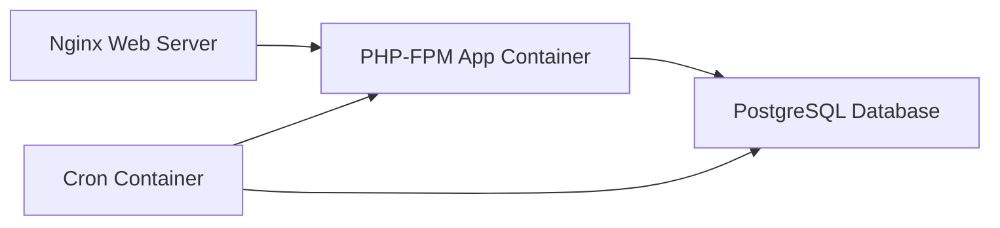

## Welcome to ipMoodle

ipMoodle is a production-ready Docker deployment solution for Moodle LMS. It provides a complete, optimized stack with PostgreSQL database, Nginx web server, and automated maintenance tasks — all orchestrated with Docker Compose.

<CardGroup cols={2}>
  <Card title="Quickstart" icon="rocket" href="/quickstart">
    Get Moodle running in minutes with our one-command deployment
  </Card>
  <Card title="Architecture" icon="sitemap" href="/architecture/overview">
    Understand the multi-container architecture and service design
  </Card>
  <Card title="Configuration" icon="sliders" href="/configuration/environment-variables">
    Customize environment variables, PHP settings, and Nginx configuration
  </Card>
  <Card title="Operations" icon="wrench" href="/operations/maintenance">
    Learn how to maintain, backup, and monitor your Moodle instance
  </Card>
</CardGroup>

## Key Features

<CardGroup cols={2}>
  <Card title="One-Command Deployment" icon="terminal">
    Run `deploy.sh` to automatically build images, configure services, and download Moodle 4.3
  </Card>
  <Card title="Optimized PHP Runtime" icon="code">
    PHP 8.2-FPM Alpine image with all required extensions: GD, Intl, SOAP, ZIP, PostgreSQL, Sodium, and more
  </Card>
  <Card title="PostgreSQL 16" icon="database">
    Modern, reliable database with Alpine-based image for minimal footprint
  </Card>
  <Card title="Nginx FastCGI" icon="server">
    High-performance web server configured for Moodle's slash arguments and large file uploads (512MB)
  </Card>
  <Card title="Automated Cron Jobs" icon="clock">
    Dedicated cron container executes Moodle maintenance tasks every minute
  </Card>
  <Card title="Persistent Storage" icon="folder">
    Docker volumes for Moodle code, user uploads (moodledata), and database files
  </Card>
</CardGroup>

## Architecture Overview

ipMoodle uses a four-container architecture:



<Info>
  All containers communicate over a dedicated `moodle-net` bridge network for isolation and security.
</Info>

### Service Breakdown

- **web** (nginx:alpine) - Listens on port 80, serves static files, proxies PHP requests to app container
- **app** (custom PHP 8.2-FPM) - Executes Moodle PHP code, connects to database
- **db** (postgres:16-alpine) - Stores Moodle data with persistent volume
- **cron** (custom PHP 8.2-FPM) - Runs scheduled tasks every minute for Moodle maintenance

## What's Included

<Steps>
  <Step title="Automated Deployment Script">
    `deploy.sh` handles environment setup, Docker builds, service startup, and Moodle download
  </Step>
  <Step title="Custom Docker Image">
    Optimized PHP 8.2-FPM with extensions: `intl`, `soap`, `zip`, `pgsql`, `pdo_pgsql`, `exif`, `opcache`, `bcmath`, `sockets`, `mbstring`, `sodium`, and `gd`
  </Step>
  <Step title="PHP Configuration">
    Pre-tuned for Moodle with 512MB memory limit, 512MB upload size, and 600s execution time
  </Step>
  <Step title="Nginx Configuration">
    FastCGI setup with slash arguments support, security hardening, and large request buffers
  </Step>
</Steps>

## Environment Variables

The deployment is configured through four core environment variables:

| Variable | Description | Default |
|----------|-------------|----------|
| `SITE_URL` | Public URL where Moodle will be accessible | (required) |
| `DB_NAME` | PostgreSQL database name | `moodle` |
| `DB_USER` | PostgreSQL username | `moodle` |
| `DB_PASS` | PostgreSQL password | `moodle` |

<Warning>
  Change `DB_PASS` to a strong password before deploying to production.
</Warning>

## Quick Example

Get started in three simple steps:

```bash
# 1. Set your site URL
export SITE_URL="http://localhost"

# 2. Run the deployment script
chmod +x deploy.sh
./deploy.sh

# 3. Access Moodle
open http://localhost
```

<Note>
  The deployment script downloads Moodle 4.3 (Latest Stable) automatically if the `./html` directory is empty.
</Note>

## Next Steps

<CardGroup cols={2}>
  <Card title="Start the Quickstart" icon="play" href="/quickstart">
    Deploy your first Moodle instance in under 5 minutes
  </Card>
  <Card title="Explore Configuration" icon="gear" href="/configuration/environment-variables">
    Learn how to customize PHP settings, database credentials, and more
  </Card>
  <Card title="Understand the Stack" icon="layer-group" href="/architecture/services">
    Deep dive into each service and how they work together
  </Card>
  <Card title="Production Deployment" icon="shield" href="/advanced/ssl-https">
    Configure SSL/HTTPS and security hardening for production use
  </Card>
</CardGroup>